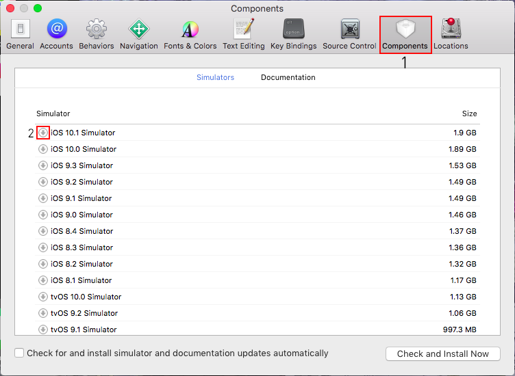
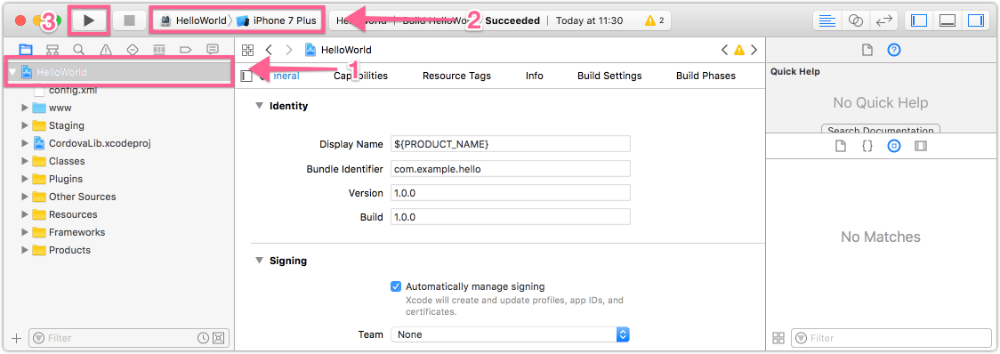
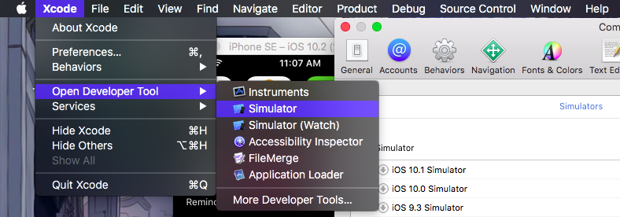

# ANGULAR 4 TO CORDOVA/PHONEGAP

Basic instructions on how to convert a functional Angular 4 project into a functioning Cordova project. This assumes you already have the working Angular 4 project. The various actions within each section have been bolded for visibility.

<!-- TOC depthFrom:1 depthTo:6 withLinks:1 updateOnSave:1 orderedList:0 -->

- [ANGULAR 4 TO CORDOVA/PHONEGAP](#angular-4-to-cordovaphonegap)
	- [Angular 4 Project Structure](#angular-4-project-structure)
	- [Preparing the Environment](#preparing-the-environment)
		- [Angular](#angular)
			- [Ubuntu and other \*nix systems](#ubuntu-and-other-nix-systems)
			- [OS X](#os-x)
			- [Windows](#windows)
		- [Cordova](#cordova)
		- [Android Build Environment](#android-build-environment)
			- [Installing Build Requirements](#installing-build-requirements)
			- [Running an Emulator](#running-an-emulator)
		- [iOS Build environment](#ios-build-environment)
			- [Opening Projects in Xcode](#opening-projects-in-xcode)
			- [Deploying for Testing](#deploying-for-testing)
			- [Running in the Simulator](#running-in-the-simulator)
	- [Setting up a Cordova Project](#setting-up-a-cordova-project)
	- [Moving Angular Code into Cordova](#moving-angular-code-into-cordova)
		- [Moving Angular Source](#moving-angular-source)
	- [Advanced Things](#advanced-things)
		- [Cordova.js Script](#cordovajs-script)
		- [CSP](#csp)
		- [Cordova Plugins](#cordova-plugins)
		- [Deploying Cordova Apps to a Device](#deploying-cordova-apps-to-a-device)
		- [Debugging Installed Apps](#debugging-installed-apps)
			- [Android](#android)
			- [macOS](#macos)
	- [Other Resources](#other-resources)

<!-- /TOC -->

## Angular 4 Project Structure

A typical Angular 4 Project might look something like this:


This would be from a typical Angular 4 project with the actual app stored in `src`, end-to-end tests in `e2e`, and various config files such as `tsconfig.json` and `package-lock.json`; `karma` files are used in the `karma` unit test system, and can be safely deleted if unit tests aren't used.

## Preparing the Environment

### Angular
Skip this if you already have a working Angular setup.

#### Ubuntu and other \*nix systems
Typically, `nodejs` and `npm` already exist in official repositories, so simply **run the package manager of your choice** to obtain both. For example, in Ubuntu run
```bash
sudo apt install nodejs
sudo apt install npm
```

If you'll need packages that require compilation, make sure you have `base-devel`/`buid-essential` or your \*nix's flavour installed.

#### OS X
**Install the Xcode** set of command-line tools:
```sh
% xcode-select --install
```

**Install the `brew`** package manager for OS X:
```sh
% ruby -e "$(curl -fsSL https://raw.githubusercontent.com/Homebrew/install/master/install)"
```

**Install `node`** with brew:
```sh
brew install node
```
Brew will automagically pull in node and npm.

#### Windows
**Install the chocolatey** package manager from [the chocolatey site](https://chocolatey.org/install). **Install `node`** with
```
C:\> choco install nodejs
```

**Check the installed versions** with
```sh
C:\> nodejs -v
C:\> npm -v
```

### Cordova
**Install the Cordova CLI** globally using `npm`:
On Windows, do:
```
C:\> npm install -g cordova
```

On OS X and Linux, do:
```sh
% sudo npm install -g cordova
```

### Android Build Environment

#### Installing Build Requirements

Android apps are built in Java, so you'll need the full JDK for building. Currently, Java supports Java 8 until 2019 and Java 10 until September of 2018. With your preferred package manager, **install a JDK** (OpenJDK or Oracle). Next, **install Gradle** from your package manager, or directly from [the Gradle website](https://gradle.org/install/). If you're on Windows, make sure to **add Gradle to your path**. **Install Android Studio** from Google's [website](https://developer.android.com/studio/), or through a package manager. **Install the SDK packages** for the intended API target level. This can be done through the `sdkmanager` command line tool, or through the graphical SDK manager within Android Studio. **Set the environment variables** `JAVA_HOME` and `ANDROID_HOME` to the Java and Android SDK install directories respectively. Finally, make sure to add `tools`, `tools/bin`, and `platform-tools` to your `PATH` variable.

#### Running an Emulator

If a physical Android device is not available on hand, you will need an Android emulator to test your app on. First, open Android Studio and then **open the AVD Manager**, located under `Tools > AVD Manager`. Create a virtual device, following the prompts on screen. Once complete, the emulator can be launched from the AVD Manager. **Launch the emulator** and make sure that a virtual device shows up without any errors. If you wish to improve your emulator performance, see [this page](https://developer.android.com/studio/run/emulator-acceleration) for more information.

### iOS Build environment

iOS apps can only be built on a macOS computer running at least OS X 10.10.4.

An internet outage happened, so unable to push everything I had, but Cordova has a basic explanation located [here](https://cordova.apache.org/docs/en/latest/guide/platforms/ios/). I'll write up more once the net is back.

Installing Xcode already fulfils most of the build requirements on iOS. The only additional package needed is `ios-deploy`; install with `npm install -g ios-deploy`.

#### Opening Projects in Xcode

Cordova builds an Xcode project when you call `cordova build ios`, which you can then open in Xcode to run the simulator or build to device. The Angular project itself is not compatible with Xcode; you must do the following to get the app into Xcode. Either run `% open ./platforms/ios/<appname>.xcworkspace/` from the root directory of your project, or open Xcode first and then open the `.xcworkspace` file from the `Open` menu.

**DO NOT** change files once you open them in Xcode, as the `platforms` folder is not synced with the rest of your project; changes made in `platforms` will not be reflected in your source code.

#### Deploying for Testing

Like Android apps, iOS apps can be tested within the iOS emulator and on an actual hardware device. However, there are certain things that need to be mentioned:

- Building apps requires an Apple ID
- Non-developer Apple IDs deploy feature-limited versions of apps. For example, in-app purchases, Game Centre, and Apple Pay cannot be used in non-developer account apps.

Thus, it is probably easier to deploy to an emulator. Xcode usually comes bundled with the most recent versions of the simulators, but you may wish to install other versions. To do so, go to **Xcode > Preferences**, and then **select the Components pane** (1). Choose the iOS version to target, and click the **Download** button (2) to install the emulator. If you don't see your desired version, your Xcode may not be up to date, or the version may no longer be supported by Apple.



#### Running in the Simulator

To run an app in the iOS simulator, there are two ways to launch the app in the emulator.

##### Manual Method



First, **select your project** in the left panel, as shown. Second, **select an emulator** from the Scheme menu. Finally, **click the run** button to launch and use the app.

##### Automatic Method



First, **launch the emulator** from the `Open Developer Tool` menu, and allow it to boot and load into iOS. Then, run `cordova run ios`, and Cordova will automatically build and deploy to the emulator.

## Setting up a Cordova Project

**Create a new Cordova project** first:
```sh
cordova create <path> <id> <name>
```
where `path` is a new folder to put the app in, `id` is the reversed domain identifier for the app (i.e. `com.example.myapp`), and `name` is the name used for the app.

**Move into the newly created folder**, and **add the platforms** that you're targeting, which could be `android`, `ios`, or `browser`:
```sh
% cordova platform add android
% cordova platform add ios
```

You can check what platforms have been added with
```sh
% cordova platform ls
```

Now, **ensure that all of the required dependencies for building have been installed**. Run
```sh
cordova requirements
```
and make sure the output shows no errors.

## Moving Angular Code into Cordova

### Moving Angular Source
To move the Angular code over into the Cordova project, simply **select all of your source files** from the root of your Angular project, and **paste it into the root directory** of the Cordova project:
```sh
cp -R <angular-project>/* <cordova-project>/
```

Cordova builds the app out of the `www` directory, so we need to redirect the Angular build output to that folder. Assuming you build from the command line with `ng`, **edit `.angular-cli.json`** and **change `outDir` to `www`**. Now, executing `ng build` should output into the `www` folder instead of `dist`.

That's it for the basics! If you now try `cordova run browser`, you should see the Angular app show up in a browser window!

## Advanced Things

### Cordova.js Script

Typically, Cordova automatically places an `<a href>` to cordova.js in `index.html` under `www` when a new application is created. When the app is built, Cordova creates the `cordova.js` appropriate for the platform and inserts it into the app. For Cordova specific features such as plugins to work the `cordova.js` file must be loaded. As the `www` directory is now being built by Angular, the reference to the script (`<script type="text/javascript" src="cordova.js"></script>`) should be **placed in `src/index.html`** in order for it to be available on every page.

### CSP

It is highly recommended that a content-security-policy directive is included in `index.html` to prevent against XSS and other attacks. This should be **added to the `<head>` element of `src/index.html`**; be aware that a highly restrictive CSP may break existing code like inline JS.

### Cordova Plugins

It is possible to install a variety of Cordova plugings that allow for the use of various different APIs such as location, screen orientation, and device information. Cordova plugins are written for use in pure JS, so using them in Angular requires proper tying info, which can usually be found at the [TypeSearch](https://microsoft.github.io/TypeSearch/) repository.

### Building and Deploying Cordova Apps

Once a Cordova project is ready for testing, it can be built using the command `cordova build <platform>`. This command prepares an APK or IPA for installation and testing on a device. The command also has two switches that are important, `--debug`/`--release` and `--device`/`--emulator`. This changes the build behaviour to target the appropriate configuration specified; this matters more for iOS where release builds may not run in the iPhone emulator.

For Android, simply running `cordova emulate android` will prepare and build your app before deploying it to an emulator. The emulator must already exist within AVD Manager. To deploy to a device connected by USB, run `cordova run android`. Note that one can also manually install the app by copy-pasting the APK that is built by Cordova to the proper location.

For iOS, running `cordova run ios` will build the app and attempt to deploy it to a connected iOS emulator or connected iOS device. The emulator and/or device must be set up in Xcode as specified in the iOS Build Environment section.

### Debugging Installed Apps

#### Android
Debugging can be done either through `logcat` or through Google Chrome's Remote Devices tab in Developer Tools. Both of these require the device to be connected through USB to the computer. It is recommended to use Chrome, as it provides a desktop view of the running app and standard web debugging tools.

#### macOS

Under Xcode's `Devices` menu is listed each device that has been used with Xcode before. Each device entry has an `Open Console` option, which will bring up a log from the device, which will record errors from the Angular/Cordova app. Explore the [Debugging Page](https://developer.apple.com/support/debugging/) from Apple's Developer Hub to learn more.

## Other Resources

Cordova's own documentation, located [here](https://cordova.apache.org/docs/en/latest/), is a good place to start with any issues or questions. Cordova is also open source, and can be found on [Github](https://github.com/apache/cordova).
